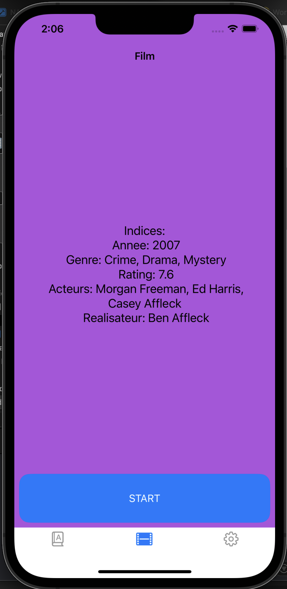
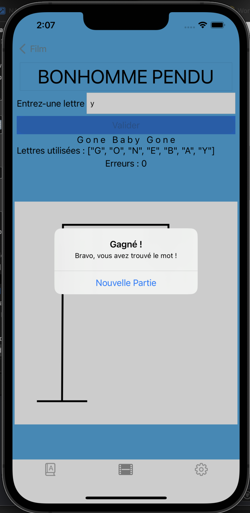

# Hangman Game iOS

## Description

iOS Hangman game that uses movie titles or dictionnary words from the OMDB API. Players guess letters to reveal the movie title before the hangman is complete.

## Screenshots

<p align="center=">
  
  
  
</p>

## Technologies

- Swift 5
- UIKit
- URLSession
- OMDB API
- Storyboard

## Setup

1. Open the project in Xcode
2. Run the project

## Features

- Random movie titles from OMDB API
- Interactive letter keyboard
- Hangman image progression
- Win/loss detection
- Restart game option
- Responsive design for iPhone and iPad
- Landscape support

## Requirements

- iOS 16.0+
- Xcode 13.0+

## APIs Used

- OMDB API - Movie titles (requires API key)
- Random Word API - Dictionary words (no key required)


## Game Modes

### Movie Mode
- Fetches random movie titles from OMDB
- Includes classic and recent films

### Dictionary Mode
- Fetches random English words
- Various difficulty levels

## Features

- **Two Game Modes** - Movies and dictionary words
- **Tab Navigation** - Easy switching between modes
- **Visual Progress** - 7-stage hangman drawing
- **Letter Tracking** - Shows used letters
- **Win/Loss Detection** - Automatic game end
- **Restart Game** - Play again instantly
- **Responsive Design** - iPhone and iPad support


## Project Structure

```
HangmanGame/
├── Model/
│   ├── HangmanGame.swift
│   ├── MovieDownloader.swift
│   ├── WordDownloader.swift
│   └── Config.swift (gitignored)
├── View/
│   └── Base.lproj/
│       └── Main.storyboard
├── Controller/
│   ├── MovieGameViewController.swift
│   └── WordGameViewController.swift
├── Ressource/
│   └── Assets.xcassets/
│       └── pendu/
│           ├── 0_echafaud.imageset
│           ├── 1_tete.imageset
│           ├── 2_corps.imageset
│           ├── 3_bras_gauche.imageset
│           ├── 4_bras_droit.imageset
│           ├── 5_jambe_gauche.imageset
│           └── 6_jambe_droite.imageset
└── Base.lproj/
```

## Contact

Rima Nafougui - rimanafougui99@gmail.com
